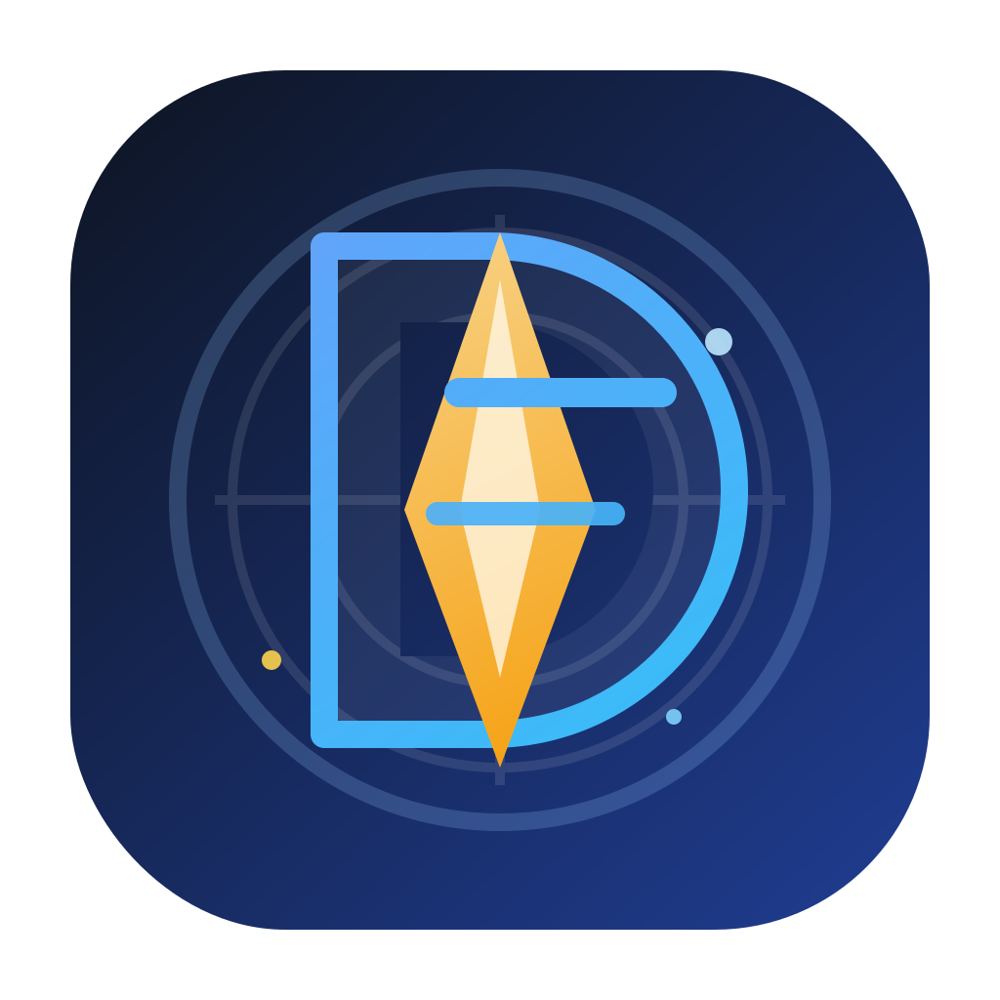

# DaVinci Design System

<div align="center">



[](https://swift.org)
[](https://developer.apple.com)
[](LICENSE)
[](https://github.com/frankgumeta/DaVinci/actions)

</div>

A Swift Package providing a modular design system for iOS 26+, built entirely with SwiftUI and Swift 6 strict concurrency.

> **Why iOS 26+?** DaVinci requires iOS 26 to leverage Swift 6 strict concurrency features, ensuring thread-safe design tokens and components. This enables modern, safe concurrent code without data races.

## Features

- 🎨 **Complete Token System**: Colors, typography, spacing, radius, elevation, motion, and more
- 🧩 **Reusable Components**: Buttons, cards, text fields, images, skeletons
- 🌓 **Dark Mode Native**: Optimized palettes for light and dark themes
- 🔒 **Type-Safe**: Swift 6 strict concurrency with `Sendable` types
- 🎭 **Themeable**: Custom themes via SwiftUI environment
- ✅ **Tested**: Comprehensive test coverage with 432+ unit tests and 34 snapshot tests
- 📱 **Live Preview**: Interactive gallery for visual verification

## Installation

### Swift Package Manager

Add DaVinci to your project using Xcode:

1. Open your project in Xcode
2. Select **File** → **Add Package Dependencies...**
3. Enter the repository URL (or local path for development)
4. Select the package products you need:
   - `DaVinciTokens` - Token system only
   - `DaVinciComponents` - Components (includes Tokens)
   - `DaVinciGallery` - Visual gallery (includes Tokens + Components)

Or add it to your `Package.swift`:

```swift
dependencies: [
    .package(url: "https://github.com/frankgumeta/DaVinci.git", from: "1.0.0")
],
targets: [
    .target(
        name: "YourTarget",
        dependencies: [
            .product(name: "DaVinciComponents", package: "DaVinci")
        ]
    )
]
```

## Quick Start

### 1. Import and Apply Theme

```swift
import SwiftUI
import DaVinciTokens
import DaVinciComponents

@main
struct YourApp: App {
    var body: some Scene {
        WindowGroup {
            ContentView()
                .dsTheme(.defaultTheme) // Apply theme to entire app
        }
    }
}
```

### 2. Use Components

```swift
import SwiftUI
import DaVinciComponents

struct ContentView: View {
    var body: some View {
        VStack(spacing: 16) {
            DSText("Welcome to DaVinci", role: .title)
            DSText("A modern design system", role: .body)
            
            DSButton("Get Started", variant: .primary) {
                print("Button tapped!")
            }
        }
        .padding()
    }
}
```

### 3. Custom Theming

```swift
import DaVinciTokens

// Create a custom theme
let customTheme = DSTheme(
    name: "custom",
    colors: DSColors(
        brand: BrandColors(
            primary: .purple,
            secondary: .blue,
            tertiary: .indigo
        )
    )
)

// Apply it
ContentView()
    .dsTheme(customTheme)
```

## Usage Examples

### Buttons

```swift
// Primary button
DSButton("Submit", variant: .primary) {
    submitForm()
}

// With icon
DSButton("Add Item", variant: .secondary, icon: .leading(systemName: "plus")) {
    addItem()
}

// Loading state
DSButton("Saving...", variant: .primary, isLoading: true) {
    // Action disabled during loading
}

// Icon-only button
DSIconButton(
    systemName: "gear",
    titleForAccessibility: "Settings",
    variant: .secondary
) {
    openSettings()
}
```

### Cards

```swift
DSCard(style: .standard) {
    VStack(alignment: .leading, spacing: 8) {
        DSText("Card Title", role: .headline)
        DSText("Card content goes here", role: .body)
    }
}
```

### Remote Images

```swift
DSRemoteImage(
    url: URL(string: "https://example.com/image.jpg"),
    width: 120,
    height: 120,
    cornerRadius: RadiusTokens.large,
    contentMode: .fill
)
```

### Skeleton Loading

```swift
// Single skeleton row
DSSkeletonRow(showLeading: true, showTrailing: false)

// Full skeleton list
DSSkeletonList(count: 5, showLeading: true, isShimmering: true)

// Skeleton card
DSSkeletonCard(showFooter: true)
```

### Using Tokens Directly

```swift
VStack(spacing: SpacingTokens.space4) {
    Text("Custom View")
        .foregroundColor(theme.colors.semantic.textPrimary)
        .font(theme.typography.headline.font(family: theme.typography.family))
}
.padding(SpacingTokens.space5)
.background(theme.colors.semantic.surfacePrimary)
.cornerRadius(RadiusTokens.medium)
```

## Targets

### DaVinciTokens

The foundational layer of the design system. Contains **immutable, value-driven, testable tokens** with no dependency on components.

| File | Purpose |
|---|---|
| `DSColors` | GrayScale primitives, SemanticColors, BrandColors, AccentColors, FeedbackColors, TextEmphasisColors, DSColors |
| `DSTypography` | FontFamily, DSTextStyle, DSTypography — type scale, sizes, weights, and `Font` builders |
| `DSSpacing` | Consistent spacing scale from 2pt to 64pt |
| `DSRadius` | Corner radius scale (`extraSmall` through `large`) |
| `DSElevation` | Shadow parameters (`none`, `small`, `medium`) |
| `DSMotion` | Animation duration and curve tokens (`fast`, `normal`, `slow`) |
| `DSOpacity` | Interaction opacity tokens (`disabled`, `pressed`, `scrim`) |
| `DSControlHeight` | Control height scale (`small`, `medium`, `large`) |
| `DSStroke` | Stroke width tokens |
| `DSTheme` | Root theme container with SwiftUI `EnvironmentValues` integration |

**Import:** `import DaVinciTokens`

### DaVinciComponents

Reusable SwiftUI components that consume tokens from `DaVinciTokens`.

| Component | Description |
|---|---|
| `DSButton` | Themed button with `.primary`, `.secondary`, `.outline` variants, leading/trailing SF Symbol icons, loading and disabled states |
| `DSIconButton` | Icon-only button with variant, size, loading, and disabled support |
| `DSText` | Semantic text component mapping roles (`.display`, `.title`, `.headline`, `.body`, `.callout`, `.caption`, `.overline`) to typography tokens |
| `DSCard` | Container view with surface styling, padding, radius, and elevation shadow |
| `DSTextField` | Themed text field with label and prompt |
| `DSPressableButtonStyle` | Shared `ButtonStyle` applying `OpacityTokens.pressed` with configurable duration |

**Import:** `import DaVinciComponents`

**Depends on:** `DaVinciTokens`

### DaVinciGallery

Interactive gallery screens for visual verification of all tokens and components. Includes a theme switcher (default / alternate).

| Screen | Purpose |
|---|---|
| `GalleryHomeScreen` | Navigation hub with theme picker |
| `ColorGalleryScreen` | Semantic, brand, accent, and feedback color swatches |
| `TypographyGalleryScreen` | Type scale preview |
| `LayoutGalleryScreen` | Spacing and radius demos |
| `EffectsGalleryScreen` | Elevation shadow demos |
| `ComponentsGalleryScreen` | All component variants, states, and sizes |

**Import:** `import DaVinciGallery`

**Depends on:** `DaVinciTokens`, `DaVinciComponents`

### DaVinciDemo

Executable app target that hosts the gallery. Useful for visual verification during development.

**Depends on:** `DaVinciTokens`, `DaVinciComponents`, `DaVinciGallery`

## Architecture

```
DaVinciTokens          (no dependencies)
       ↑
DaVinciComponents      (depends on Tokens)
       ↑
DaVinciGallery         (depends on Tokens + Components)
       ↑
DaVinciDemo            (depends on all)
```

- **All token structs are immutable** (`public let`) and `Sendable` — safe to use from any isolation context.
- **`DSTheme`** is injected via the `.dsTheme` SwiftUI environment value.
- **Swift 6 strict concurrency** is enforced across all targets (`swift-tools-version: 6.2`).
- **No `Equatable` on Color-containing types** — structs with `SwiftUI.Color` fields omit `Equatable` to avoid unstable equality.

## Testing

Run the test suite to validate tokens and components:

```bash
# Run all tests on iOS Simulator
xcodebuild test \
  -scheme DaVinci-Package \
  -destination 'platform=iOS Simulator,name=iPhone 17,OS=latest'

# Run with verbose output
xcodebuild test \
  -scheme DaVinci-Package \
  -destination 'platform=iOS Simulator,name=iPhone 17,OS=latest' \
  -verbose
```

### Test Coverage

**DaVinciTokens** (432 test cases):
- Token scale ordering (spacing, radius, font sizes, control heights are ascending)
- Token value correctness (semantic defaults, opacity, motion, stroke)
- Semantic color default mappings
- TextEmphasis derivation from brand and feedback colors
- Theme override propagation
- Dark mode palette resolution

**DaVinciComponents** (50+ test cases):
- **Unit tests**: Component instantiation, state management (loading, disabled), theme integration
- **Snapshot tests** (34 visual regression tests): Button variants, card styles, text fields, icon buttons in light/dark modes
- **Accessibility tests**: VoiceOver support, semantic labels, WCAG compliance

### Snapshot Testing

Visual regression tests ensure UI consistency:

```bash
# Record new snapshots
RECORD_SNAPSHOTS=1 xcodebuild test \
  -scheme DaVinci-Package \
  -destination 'platform=iOS Simulator,name=iPhone 17,OS=latest'

# Compare against references (default)
xcodebuild test \
  -scheme DaVinci-Package \
  -destination 'platform=iOS Simulator,name=iPhone 17,OS=latest'
```

Snapshots are stored in `Tests/DaVinciComponentsTests/__Snapshots__/` and cover all component variants in light and dark modes.

## Best Practices

### Theme Management

Always inject the theme at the app root level:

```swift
@main
struct YourApp: App {
    @State private var currentTheme = DSTheme.defaultTheme
    
    var body: some Scene {
        WindowGroup {
            ContentView()
                .dsTheme(currentTheme) // Single source of truth
        }
    }
}
```

### Using Tokens vs Components

**Use components when possible:**
```swift
// ✅ Preferred
DSButton("Submit", variant: .primary) { }

// ❌ Avoid rebuilding components
Button("Submit") { }
    .padding(.horizontal, SpacingTokens.space5)
    .background(theme.colors.brand.primary)
    // ... manual styling
```

**Use tokens for custom views:**
```swift
// ✅ Good - custom layout with tokens
VStack(spacing: SpacingTokens.space4) {
    CustomHeader()
        .foregroundColor(theme.colors.semantic.textPrimary)
}
.padding(SpacingTokens.space5)
```

### Accessibility

Components include comprehensive accessibility support following WCAG 2.1 Level AA guidelines.

```swift
// Icon buttons require accessibility labels
DSIconButton(
    systemName: "trash",
    titleForAccessibility: "Delete item", // VoiceOver reads this
    variant: .secondary
) { deleteItem() }

// Remote images support custom labels
DSRemoteImage(
    url: avatarURL,
    size: CGSize(width: 80, height: 80),
    accessibilityLabel: "User profile picture"
)
```

**Key Features:**
- ✅ WCAG AA contrast ratios for all color combinations
- ✅ Dynamic Type support
- ✅ VoiceOver optimized
- ✅ Reduce Motion respected
- ✅ Minimum 44pt touch targets

For complete accessibility guidelines, color contrast ratios, and testing procedures, see [ACCESSIBILITY.md](ACCESSIBILITY.md).

### Performance

**DSRemoteImage** includes automatic caching:
```swift
// First load: fetches from network
DSRemoteImage(url: imageURL, width: 100, height: 100)

// Subsequent loads: instant from cache
DSRemoteImage(url: imageURL, width: 100, height: 100)
```

Cache is shared across all `DSRemoteImage` instances in the app.

## Documentation

- **[CONTRIBUTING.md](CONTRIBUTING.md)** - Contribution guidelines, coding standards, and development workflow
- **[CHANGELOG.md](CHANGELOG.md)** - Version history and release notes
- **[ACCESSIBILITY.md](ACCESSIBILITY.md)** - Accessibility guidelines, WCAG compliance, and testing procedures

## Contributing

We welcome contributions! Please see [CONTRIBUTING.md](CONTRIBUTING.md) for guidelines on:
- Development workflow and branch naming
- Coding standards and best practices
- Testing requirements and coverage
- Pull request process
- Semantic versioning policy

## License

DaVinci is available under the MIT license. See [LICENSE](LICENSE) for details.

## Changelog

See [CHANGELOG.md](CHANGELOG.md) for a list of changes in each version.
