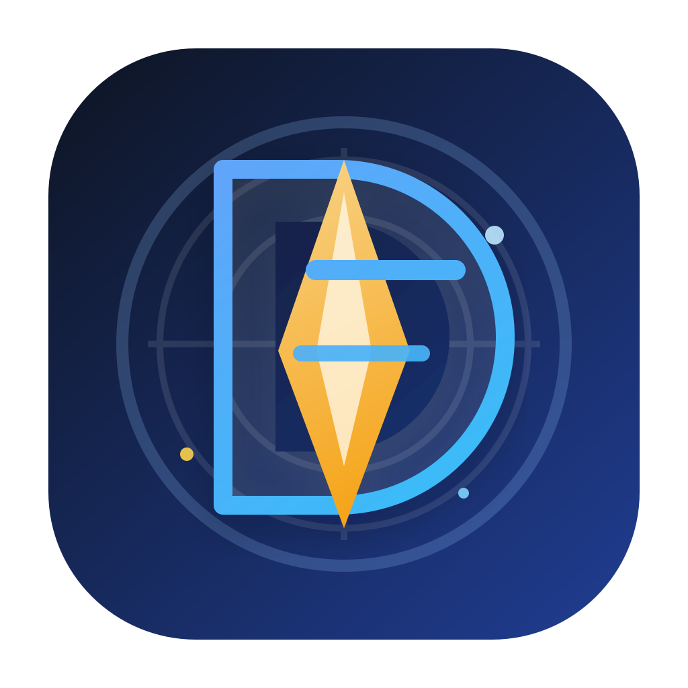

# DaVinci Design System

<div align="center">



[](https://swift.org)
[](https://developer.apple.com)
[](LICENSE)
[](https://github.com/frankgumeta/DaVinci/actions)

</div>

A Swift Package providing a modular design system for iOS 17+, built entirely with SwiftUI and Swift 6 strict concurrency.

DaVinci requires iOS 17 because its accessibility contracts use the toggle trait
introduced in that release. Swift 6 strict concurrency is a compiler and language
requirement; it does not require a matching iOS deployment target. See the
[compatibility matrix](Docs/Compatibility.md) for the supported toolchain and test
strategy.

## Features

- 🎨 **Complete Token System**: Colors, typography, spacing, radius, elevation, motion, and more
- 🧩 **Reusable Components**: Buttons, cards, text fields, images, skeletons
- 🌓 **Dark Mode Native**: Optimized palettes for light and dark themes
- 🔒 **Type-Safe**: Swift 6 strict concurrency with `Sendable` types
- 🎭 **Themeable**: Custom themes via SwiftUI environment
- ✅ **Tested**: Comprehensive test coverage with >95% code coverage across all targets
- 📱 **Live Preview**: Interactive gallery for visual verification

## Installation

### Swift Package Manager

Add DaVinci to your project using Xcode:

1. Open your project in Xcode
2. Select **File** → **Add Package Dependencies...**
3. Enter the repository URL (or local path for development)
4. Select the package products you need:
   - `DaVinciTokens` - Token system only
   - `DaVinciComponents` - Components (includes Tokens)
   - `DaVinciGallery` - Visual gallery (includes Tokens + Components)

Or add it to your `Package.swift`:

```swift
dependencies: [
    .package(url: "https://github.com/frankgumeta/DaVinci.git", from: "1.0.0")
],
targets: [
    .target(
        name: "YourTarget",
        dependencies: [
            .product(name: "DaVinciComponents", package: "DaVinci")
        ]
    )
]
```

## Quick Start

### 1. Import and Apply Theme

```swift
import SwiftUI
import DaVinciTokens
import DaVinciComponents

@main
struct YourApp: App {
    var body: some Scene {
        WindowGroup {
            ContentView()
                .dsTheme(.defaultTheme) // Apply theme to entire app
        }
    }
}
```

### 2. Use Components

```swift
import SwiftUI
import DaVinciComponents

struct ContentView: View {
    var body: some View {
        VStack(spacing: 16) {
            DSText("Welcome to DaVinci", role: .title)
            DSText("A modern design system", role: .body)
            
            DSButton("Get Started", variant: .primary) {
                print("Button tapped!")
            }
        }
        .padding()
    }
}
```

### 3. Custom Theming

```swift
import DaVinciTokens

// Create a custom theme
let customTheme = DSTheme(
    name: "custom",
    colors: DSColors(
        brand: BrandColors(
            primary: .purple,
            secondary: .blue,
            tertiary: .indigo
        )
    )
)

// Apply it
ContentView()
    .dsTheme(customTheme)
```

## Usage Examples

### Buttons

```swift
// Primary button
DSButton("Submit", variant: .primary) {
    submitForm()
}

// With icon
DSButton("Add Item", variant: .secondary, icon: .leading(systemName: "plus")) {
    addItem()
}

// Loading state
DSButton("Saving...", variant: .primary, isLoading: true) {
    // Action disabled during loading
}

// Icon-only button
DSIconButton(
    systemName: "gear",
    titleForAccessibility: "Settings",
    variant: .secondary
) {
    openSettings()
}
```

### Cards

```swift
DSCard(style: .standard) {
    VStack(alignment: .leading, spacing: 8) {
        DSText("Card Title", role: .headline)
        DSText("Card content goes here", role: .body)
    }
}
```

### Remote Images

```swift
DSRemoteImage(
    url: URL(string: "https://example.com/image.jpg"),
    width: 120,
    height: 120,
    cornerRadius: RadiusTokens.large,
    contentMode: .fill
)
```

### Skeleton Loading

```swift
// Single skeleton row
DSSkeletonRow(showLeading: true, showTrailing: false)

// Full skeleton list
DSSkeletonList(count: 5, showLeading: true, isShimmering: true)

// Skeleton card
DSSkeletonCard(showFooter: true)
```

### Using Tokens Directly

```swift
VStack(spacing: SpacingTokens.space4) {
    Text("Custom View")
        .foregroundColor(theme.colors.semantic.textPrimary)
        .dsTextStyle(theme.typography.headline, family: theme.typography.family)
}
.padding(SpacingTokens.space5)
.background(theme.colors.semantic.surfacePrimary)
.cornerRadius(RadiusTokens.medium)
```

## Targets

### DaVinciTokens

The foundational layer of the design system. Contains **immutable, value-driven, testable tokens** with no dependency on components.

| File | Purpose |
|---|---|
| `DSColors` | GrayScale primitives, SemanticColors, BrandColors, AccentColors, FeedbackColors, TextEmphasisColors, DSColors |
| `DSTypography` | Semantic Dynamic Type roles, font families, weights, and scaled line-height support |
| `DSSpacing` | Consistent spacing scale from 2pt to 64pt |
| `DSRadius` | Corner radius scale (`extraSmall` through `large`) |
| `DSElevation` | Shadow parameters (`none`, `small`, `medium`) |
| `DSMotion` | Animation duration and curve tokens (`fast`, `normal`, `slow`) |
| `DSOpacity` | Interaction opacity tokens (`disabled`, `pressed`, `scrim`) |
| `DSControlHeight` | Control height scale (`small`, `medium`, `large`) |
| `DSStroke` | Stroke width tokens |
| `DSTheme` | Root theme container with SwiftUI `EnvironmentValues` integration |

**Import:** `import DaVinciTokens`

### DaVinciComponents

Reusable SwiftUI components that consume tokens from `DaVinciTokens`.

| Component | Description |
|---|---|
| `DSButton` | Themed button with `.primary`, `.secondary`, `.outline` variants, leading/trailing SF Symbol icons, loading and disabled states |
| `DSIconButton` | Icon-only button with variant, size, loading, and disabled support |
| `DSText` | Semantic text component mapping roles (`.display`, `.title`, `.headline`, `.body`, `.callout`, `.caption`, `.overline`) to typography tokens |
| `DSCard` | Container view with surface styling, padding, radius, and elevation shadow |
| `DSTextField` | Themed text field with label and prompt |
| `DSPressableButtonStyle` | Shared `ButtonStyle` applying `OpacityTokens.pressed` with configurable duration |

**Import:** `import DaVinciComponents`

**Depends on:** `DaVinciTokens`

### DaVinciGallery

Interactive gallery screens for visual verification of all tokens and components. Includes a theme switcher (default / alternate).

| Screen | Purpose |
|---|---|
| `GalleryHomeScreen` | Navigation hub with theme picker |
| `ColorGalleryScreen` | Semantic, brand, accent, and feedback color swatches |
| `TypographyGalleryScreen` | Type scale preview |
| `LayoutGalleryScreen` | Spacing and radius demos |
| `EffectsGalleryScreen` | Elevation shadow demos |
| `ComponentsGalleryScreen` | All component variants, states, and sizes |

**Import:** `import DaVinciGallery`

**Depends on:** `DaVinciTokens`, `DaVinciComponents`

### DaVinciDemo

Executable app target that hosts the gallery. Useful for visual verification during development.

**Depends on:** `DaVinciTokens`, `DaVinciComponents`, `DaVinciGallery`

## Architecture

```
DaVinciTokens          (no dependencies)
       ↑
DaVinciComponents      (depends on Tokens)
       ↑
DaVinciGallery         (depends on Tokens + Components)
       ↑
DaVinciDemo            (depends on all)
```

- **All token structs are immutable** (`public let`) and `Sendable` — safe to use from any isolation context.
- **`DSTheme`** is injected via the `.dsTheme` SwiftUI environment value.
- **Swift 6 strict concurrency** is enforced across all targets (`swift-tools-version: 6.0`).
- **No `Equatable` on Color-containing types** — structs with `SwiftUI.Color` fields omit `Equatable` to avoid unstable equality.

## Testing

Run the test suite to validate tokens and components:

```bash
# Create and boot an iPhone using the latest installed iOS runtime
SIMULATOR_UDID="$(bash .github/scripts/create-ios-simulator.sh)"

# Run all tests on that simulator
xcodebuild test \
  -scheme DaVinci-Package \
  -destination "platform=iOS Simulator,id=$SIMULATOR_UDID"

# Run with verbose output
xcodebuild test \
  -scheme DaVinci-Package \
  -destination "platform=iOS Simulator,id=$SIMULATOR_UDID" \
  -verbose
```

The package is iOS-only, so plain `swift test` is not a supported validation
command. CI also compiles all products with an iOS 17 deployment target against
the current SDK:

```bash
xcodebuild build \
  -scheme DaVinci-Package \
  -destination 'generic/platform=iOS Simulator' \
  IPHONEOS_DEPLOYMENT_TARGET=17.0
```

### Test Coverage

DaVinci maintains **>95% code coverage** across all targets with comprehensive behavioral and visual regression tests.

**DaVinciTokens** (100% coverage):
- Token scale ordering (spacing, radius, font sizes, control heights are ascending)
- Token value correctness (semantic defaults, opacity, motion, stroke)
- Semantic color default mappings
- TextEmphasis derivation from brand and feedback colors
- Theme override propagation
- Dark mode palette resolution

**DaVinciComponents** (>92% coverage):
- **Behavioral tests**: Component logic, state management, accessibility label resolution, theme integration
- **Snapshot tests**: Visual regression coverage for all component variants in light/dark modes
- **Accessibility tests**: Semantic contracts, contrast pairs, touch targets, and manual VoiceOver checklist

### Snapshot Testing

Visual regression tests normalize reference and received images to RGBA8 and compare
their pixels. Missing references fail by default; recording is always explicit.

```bash
# Record new snapshots
RECORD_SNAPSHOTS=1 xcodebuild test \
  -scheme DaVinci-Package \
  -destination "platform=iOS Simulator,id=$SIMULATOR_UDID"

# Compare against references (default)
xcodebuild test \
  -scheme DaVinci-Package \
  -destination "platform=iOS Simulator,id=$SIMULATOR_UDID"
```

Snapshots are stored in `Tests/DaVinciComponentsTests/__Snapshots__/` and cover all component variants in light and dark modes.

The comparator treats channel deltas up to `2/255` as rendering noise and accepts at
most 0.5% differing pixels with a 0.1% normalized mean channel difference. When a
comparison fails, expected, received, and visual diff images are written to
`.build/snapshot-failures/`. CI uploads that directory as the `snapshot-failures`
artifact on failed runs.

Snapshot rendering fixes the canvas size, 2x scale, `en_US_POSIX` locale, UTC time
zone, left-to-right layout, Dynamic Type `.large`, theme, and color scheme. Use the
repository simulator helper and latest stable Xcode, matching CI, when approving
baselines.

## Best Practices

### Theme Management

Always inject the theme at the app root level:

```swift
@main
struct YourApp: App {
    @State private var currentTheme = DSTheme.defaultTheme
    
    var body: some Scene {
        WindowGroup {
            ContentView()
                .dsTheme(currentTheme) // Single source of truth
        }
    }
}
```

### Using Tokens vs Components

**Use components when possible:**
```swift
// ✅ Preferred
DSButton("Submit", variant: .primary) { }

// ❌ Avoid rebuilding components
Button("Submit") { }
    .padding(.horizontal, SpacingTokens.space5)
    .background(theme.colors.brand.primary)
    // ... manual styling
```

**Use tokens for custom views:**
```swift
// ✅ Good - custom layout with tokens
VStack(spacing: SpacingTokens.space4) {
    CustomHeader()
        .foregroundColor(theme.colors.semantic.textPrimary)
}
.padding(SpacingTokens.space5)
```

### Accessibility

Components provide testable accessibility semantics and are designed with WCAG 2.1
Level AA criteria in mind. This is not a certification; VoiceOver focus order,
announcements, and keyboard navigation still require manual validation in the host app.

```swift
// Icon buttons require accessibility labels
DSIconButton(
    systemName: "trash",
    titleForAccessibility: "Delete item", // VoiceOver reads this
    variant: .secondary
) { deleteItem() }

// Remote images support custom labels
DSRemoteImage(
    url: avatarURL,
    size: CGSize(width: 80, height: 80),
    accessibilityLabel: "User profile picture"
)

// Decorative images are removed from the accessibility tree
DSRemoteImage(
    url: backgroundURL,
    size: CGSize(width: 120, height: 80),
    isDecorative: true
)
```

**Key Features:**
- ✅ Automated 4.5:1 text and 3:1 interactive-outline checks for documented pairs
- ✅ Dynamic Type support
- ✅ Labels, values, hints, traits, grouping, and loading/disabled contracts
- ✅ Reduce Motion respected
- ✅ Minimum 44pt touch targets

For complete accessibility guidelines, color contrast ratios, and testing procedures, see [ACCESSIBILITY.md](ACCESSIBILITY.md).

### Performance

**DSRemoteImage** uses a shared validated image pipeline:
```swift
// First load: fetches from network
DSRemoteImage(url: imageURL, width: 100, height: 100)

// Subsequent loads: instant from cache
DSRemoteImage(url: imageURL, width: 100, height: 100)
```

Concurrent requests for the same URL share one load. The default loader accepts
successful HTTP responses with supported image MIME types; payloads must also decode
as images before reaching success or the cache. Decoding runs away from the main
actor, payloads are limited to 20 MB and 40 megapixels, and the shared decoded-image
LRU cache has a 50 MB cost budget. Failed requests are not cached, so recreating the
view or changing its URL can retry them.

## Documentation

- **[CONTRIBUTING.md](CONTRIBUTING.md)** - Contribution guidelines, coding standards, and development workflow
- **[CHANGELOG.md](CHANGELOG.md)** - Version history and release notes
- **[ACCESSIBILITY.md](ACCESSIBILITY.md)** - Accessibility guarantees, limitations, and testing procedures

## Contributing

We welcome contributions! Please see [CONTRIBUTING.md](CONTRIBUTING.md) for guidelines on:
- Development workflow and branch naming
- Coding standards and best practices
- Testing requirements and coverage
- Pull request process
- Semantic versioning policy

## License

DaVinci is available under the MIT license. See [LICENSE](LICENSE) for details.

## Changelog

See [CHANGELOG.md](CHANGELOG.md) for a list of changes in each version.
